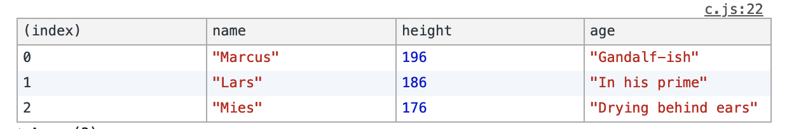
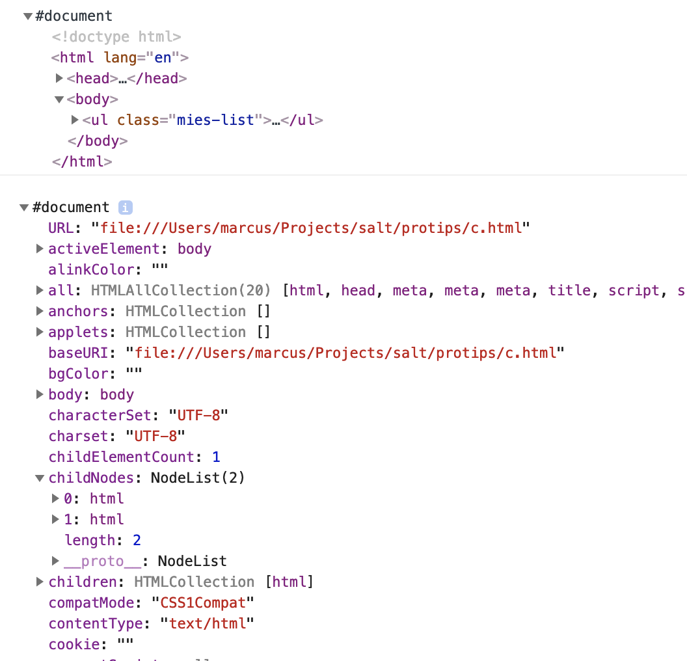

**This site is deprecated and all the content has moved to [AppliedTechnology](https://appliedtechnology.github.io/protips/)**

# Console can do more than just .log
Using the `console.log` is the goto way to debug your code, that most of us has used many many times.

This post goes through a few of the lesser known tricks that `console` has up its sleeve

## Where is the console printing?

For example, given this code in a file (`c.js`):

```javascript
const name = 'Marcus';
console.log(name);
```

Will print `Marcus` at the terminal if you ran it with `node c.js`.

If you included that file into an HTML document:

```HTML
<!DOCTYPE html>
<html lang="en">
<head>
  <script src="./c.js"></script>
</head>
<body>
</body>

</html>
```

It would print to the browser console (that you would see by open the developer tools)

## Using a label
A very simple, but useful, trick is to set a label for the log statement.

```javascript
console.log('Person name:', name);
console.log(`Name of ${name}:`, name);
```

Would log:

```bash
Person name: Marcus
Name of Marcus: Marcus
```

## What are we logging?
Just logging: `console.log(name)` above, gives us a bit too little information. Just: `Marcus`. But what is that?

A very simple hack is to wrap the variable with `{}` which will give you the name of the variable you logged too:

```javascript
console.log({name})
```

This will output:
```bash
{ name: 'Marcus' }
```

## Log arrays with .table
Let's say that you have a lot of data like this:

```javascript
const people = [{
  name: 'Marcus',
  height: 196,
  age: 'Gandalf-ish'
},
{
  name: 'Lars',
  height: 186,
  age: 'In his prime'
},
{
  name: 'Mies',
  height: 176,
  age: 'Drying behind ears'
}]
```

If you log this with `console.log` it will list the objects in long string, in the terminal. In the browser it will produce a collapsable list of object

But we can do better by doing `console.table(people)` that will produce the following table in the terminal:

```bash
┌─────────┬──────────┬────────┬──────────────────────┐
│ (index) │   name   │ height │         age          │
├─────────┼──────────┼────────┼──────────────────────┤
│    0    │ 'Marcus' │  196   │    'Gandalf-ish'     │
│    1    │  'Lars'  │  186   │    'In his prime'    │
│    2    │  'Mies'  │  176   │ 'Drying behind ears' │
└─────────┴──────────┴────────┴──────────────────────┘
```

In the browser and even nice formatted table with the same result will be outputted:



## The difference of .log and .dir

There are two functions on `console` that are pretty similar: `console.log` and `console.dir`. Both of these output data to the console, and for the most part in the exact same way. For example, in Node in the terminal it would be exactly the same.

But there's a subtle difference: if you log HTML in the Browser it would be different.

* `console.log(document)` will produce a HTML node list that you can expand through the nodes
* `console.dir(document)` will produce a JSON object for the HTML document



## Time your stuff simply
With `console.time` we can make a simple timer for long running functions.

Imagine that we have a long running function that takes ... a long time to run. We can time it like this:

```javascript
console.time('LongRunningTimer');
longRunning(() => {
  console.timeEnd('LongRunningTimer')
})
```

This will output:

```bash
LongRunningTimer: 3004.526ms
```

That first parameter (in our example: `LongRunningTimer`) is a key so that `console` knows which timer we are talking about. We can, in other words, have many timers running.

We can even log intermediate values of the timer with the logger using `console.timeLog('LongRunningTimer')`. This could be useful for asynchronous operation.
