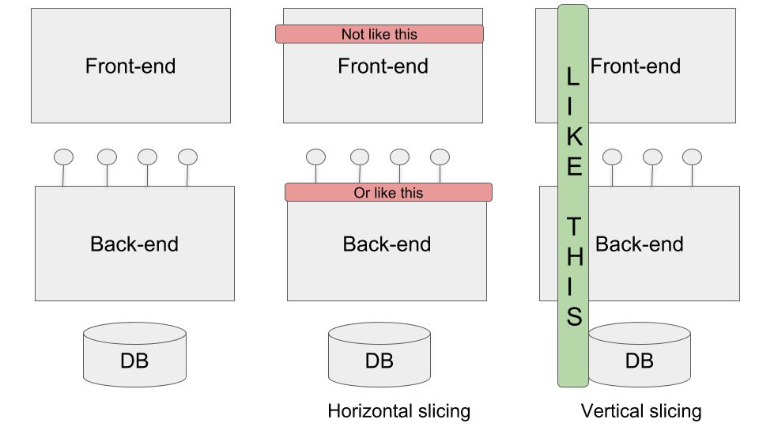

When given a bigger task you will benefit greatly from slicing it up into smaller chunks. And when you do that you almost always benefits from doing vertical slices over horizontal slices. 

This post describes what that means and how you can go about doing this. 

## An example
Let's say that you are given a job interview question to create a blog engine with a front-end and a back-end to store the blog posts. The finished app should support the following use-cases: 

* List all blog posts
* Create a new blog post, with a title, description and an author name
* Show one blog post, displaying the fields above
* Update the fields
* Delete the post

You have 3 hours to complete the task. 

How would you approach this? I can think of two distinct options. 

# The horizontal slicing approach
You can start by slicing this horizontally; meaning layer by layer. If you then started from the bottom you would write all the back-end methods for getting all posts, get one post, creating a post, etc etc.

Once that is done the backend (hopefully) works correctly and you can now turn your attention to calling these backend endpoints from the front-end pages. 

Obviously, you could start with the front-end layer, but that is often a bit trickier since you then need to fake or mock the back-end somehow. 

Pros with this approach:
* it's sometimes easier to do everything in one layer and keep your focus

Cons with this approach:
* nothing is done until everything is done. You cannot test the application until you wired everything together. 
* if you did a thinking mistake or misconception in the back-end part you will not know that until when you're trying to use it from the front-end. Since that is later it might be hard to remember what you did earlier
* also, should you need to change the back-end you will have to ensure that nothing that uses the backend breaks with the changes you make

In short; the horizontal approach prolongs the feedback loop since you will not know how it works until you have completed both ends. 

# The vertical slicing approach
The vertical slicing approach means that you would start by building only the "List all blog posts"-feature. You could start by writing the minimal amount of code to just return all the posts from the back-end. Once that works you could then start implementing the listing and processing of those posts on the front-end.

When one of the use-cases is completed you can test it fully and see that it works and that everything is wired up correctly, before turning to the next use-case, like "Show one blog post", for example. 

Cons with this approach:
* You will shift your back-end/front-end focus rapidly - but you will keep your use-case focus intact. 

Pros with this approach: 
* You will get something that works really fast
* You can test use-case by use-case as you complete them
* As long as you keep the code well isolated (don't use the same back-end functions for more than one thing, for example) you can move more securely knowing that you will not break anything. 

In short: the vertical slicing approach will help you to shorten the feedback loop and move more securely and confidently. 

## Summary

When you get any sized programming task, try to find a way to slice it vertically rather than horizontally. This will help you to move faster, move with confidence and to give you small successes along the way. 

This is actually one of the great benefits of writing tests for your code, that way you slice your coding-tasks up even more granular. 

A special word needs to be said about the case of an interview question. If you do a vertical slice of something that vertical slice works. That code can be assessed separately. Even if you haven't finished the whole task the parts that you have finished can still prove useful and noteworthy to a further employer. 