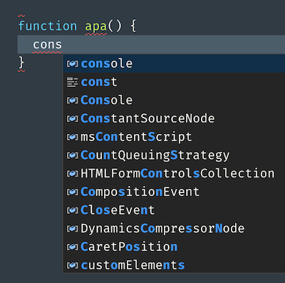
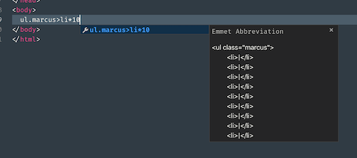

We got some more input from students (Przemek) on tips and tricks for Visual Studio Code, that we wanted to share.

## Intellisense and emmet

A number of functions, snippets and templates are already built into VS Code in form of Intellisense autocomplete feature, or emmet. Simpy start typing function you want to access and select from given language basic set. Depending on file you're working you have access to files' set or you could manually select language from status bar.



In an HTML-file you will find both emmet and language basics availablle. Although their snippets differ somewhat, they still have uses. For instance emmet allows build whole elements using single line of code including all properties and text content.



As a little demonstration of what Emmet can do type this in a HTML-file and press tab:

```
div.marcus>div.lars*10>lorem10
```

In case of CSS, Emmet also doubles as intellisense's autocompletion.

### More information about Emmet

* https://code.visualstudio.com/blogs/2017/08/07/emmet-2.0
* https://docs.emmet.io/actions/

## Shortcuts

We have a short list of [shortcuts over here](saveyourfingers-2.md), but regarding keyboard shortcuts, these are there for you to save on time, get used to using them. Most useful cases are for copying line of code up or down, moving line of code up or down, prettying / formating the document. Somewhat more sophisticated uses include multiselect lines up or down from your original line or on click.

More on very [useful shortcuts (and a cheatsheet) you can read here](https://code.visualstudio.com/docs/getstarted/tips-and-tricks)

## Misc

* There's a nifty feature called multiselect. As name suggest it allows modifying multiple lines / objects / instances / places at the same time. Use Shift+Option to select a word. To deselect simply tap ESC.

* Statusbar hold a lot of information most typically: current language, indent type, indent size, misc. extensions information. That's where it's easiest to select and enforce indentation in editor.


